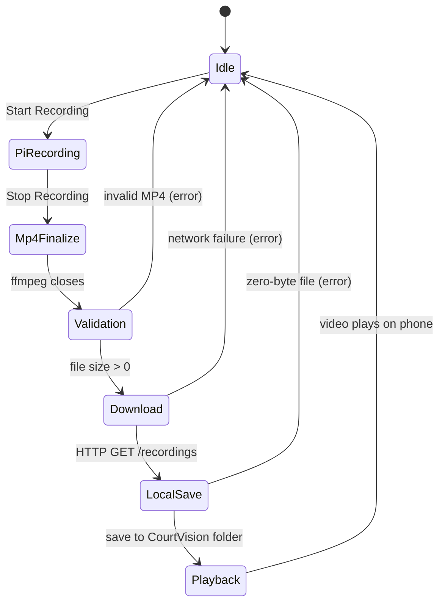

# CourtVision V4 Recording MVP

Priority: Pi Camera Module 3 records → valid MP4 → phone download → local save → playback.

## Pi paths

| Purpose | Path |
|---------|------|
| Temp recordings | `/tmp/courtvision-recordings/` |
| Filename pattern | `courtvision-YYYYMMDD-HHMMSS-<id>.mp4` |

## Recording commands

```bash
rpicam-vid --timeout 0 --codec h264 --inline \
  --width 1280 --height 720 --framerate 30 --intra 15 --nopreview -o -

ffmpeg -y -f h264 -r 30 -i pipe:0 -an \
  -c:v libx264 -preset veryfast -pix_fmt yuv420p \
  -profile:v baseline -level 3.1 -movflags +faststart output.mp4
```

## Phone paths

| Purpose | Path |
|---------|------|
| Saved videos | `<app documents>/CourtVision/<filename>.mp4` |

## API contracts

### `POST /recording/start`

Success:

```json
{
  "success": true,
  "recordingId": "courtvision-20260701-120000-a1b2c3d4",
  "filename": "courtvision-20260701-120000-a1b2c3d4.mp4",
  "processesRunning": true,
  "recordingActive": true,
  "cameraPid": 1234,
  "ffmpegPid": 1235,
  "cameraState": "RECORDING"
}
```

Failure:

```json
{
  "success": false,
  "message": "exact reason"
}
```

### `POST /recording/stop`

Request:

```json
{
  "recordingId": "courtvision-20260701-120000-a1b2c3d4"
}
```

Success:

```json
{
  "success": true,
  "recordingId": "courtvision-20260701-120000-a1b2c3d4",
  "filename": "courtvision-20260701-120000-a1b2c3d4.mp4",
  "downloadUrl": "/recordings/courtvision-20260701-120000-a1b2c3d4.mp4",
  "fileSize": 1234567,
  "validation": {
    "fileExists": true,
    "fileSize": 1234567,
    "ffprobeAvailable": true,
    "duration": 5.2,
    "validVideoStream": true,
    "passed": true
  },
  "cameraState": "IDLE"
}
```

### `GET /recordings/<filename>`

Returns `video/mp4` attachment on success.

Failure:

```json
{
  "success": false,
  "message": "Recording was not found on the Raspberry Pi."
}
```

### `DELETE /recordings/<filename>`

After confirmed phone download:

```json
{
  "downloaded": true
}
```

## State diagram



## End-to-end test sequence

### 1. Start backend

```bash
cd /home/andy76/courtvision/backend
. .venv/bin/activate
PORT=5000 python app.py
```

Expected:
- Log: Flask running on `0.0.0.0:5000`
- `GET /status` → `recordingActive: false`, `cameraState: IDLE`

### 2. Press Record

Expected app state: `recording`
Expected API: `POST /recording/start` → HTTP 200, `processesRunning: true`
Expected Pi: `rpicam-vid` and `ffmpeg` PIDs logged
Expected file path: `/tmp/courtvision-recordings/courtvision-*.mp4` (growing)

### 3. Wait 5 seconds

Expected app state: `recording`
Expected Pi: both processes still running

### 4. Stop Recording

Expected app state: `saving` then `idle`
Expected API: `POST /recording/stop` → HTTP 200, `fileSize > 0`
Expected Pi log: `Recording stopped ... validation=...`

### 5. Download MP4

Expected API: `GET /recordings/<filename>` → HTTP 200
Expected size check: response body > 0 bytes

### 6. Save locally

Expected phone path: `.../CourtVision/courtvision-*.mp4`
Expected local size: `> 0` bytes

### 7. Play video

Expected: `expo-video` player loads saved URI and plays on iPhone/Android

## Success criteria

All must be true:

1. User tapped Record
2. Pi camera process started
3. User tapped Stop
4. MP4 exists on Pi
5. MP4 size > 0
6. MP4 container valid (ffprobe when available)
7. App downloaded file
8. File saved in phone storage
9. Video plays on phone
